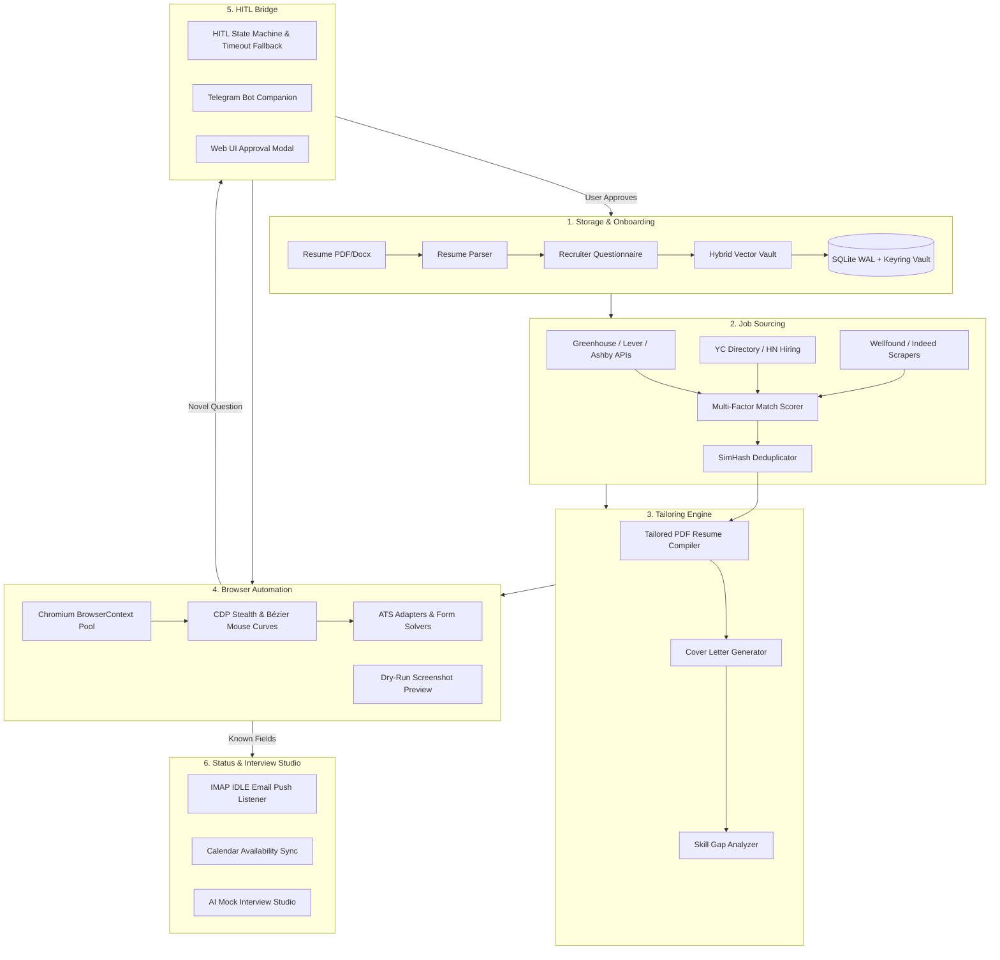

# JobCopilot

**Local-first autonomous job application bot and career copilot.**

JobCopilot automates the tedious parts of job hunting. It monitors job boards and career APIs, compiles targeted PDF resumes per role, fills out multi-page ATS forms using humanized browser automation, handles unfamiliar questions via real-time user prompts, and tracks application statuses directly from your email inbox.

---

## Key Features

- **Self-Learning Knowledge Vault**: When the bot encounters an unindexed form field or custom essay question, it prompts you once (via the web UI or Telegram). Once you approve or edit the answer, it is stored in your local vector vault and reused automatically for future applications.
- **Direct ATS API & 0-Day Sourcing**: Discovers openings directly from Greenhouse, Lever, and Ashby public APIs in under 2 seconds, alongside curated scrapers for Y Combinator (Work at a Startup), Wellfound, and Hacker News hiring threads.
- **Dynamic PDF Resume Generation**: Compiles custom, ATS-parseable PDF resumes tailored to the target job description using Chromium CSS Paged Media—no heavy LaTeX dependencies required.
- **Multi-ATS Browser Worker Pool**: Multi-threaded Playwright workers with adapters for **Greenhouse, Lever, Ashby, Workday, YC, Wellfound, and Indeed**.
- **Anti-Bot Stealth Engine**: Bypasses bot detection using Chrome DevTools Protocol (CDP) evasion (`navigator.webdriver` masking), cubic Bézier mouse movement curves, digraph-based keystroke latency, honeypot input bypass, and canvas signature rendering.
- **Multi-Channel Outreach**: Auto-generates concise, 3-sentence cold emails to engineering leads and LinkedIn connection notes tailored to the role.
- **Real-Time Email Tracking**: Uses IMAP IDLE push listeners to automatically parse application receipts, interview invitations, and status updates directly into a Kanban board.
- **AI Mock Interview Studio**: Generates role-specific technical question sets, company architecture dossiers, and verbal answer scoring.
- **Compensation Benchmarking**: Compares compensation against Levels.fyi percentiles and models startup equity (ESOP) scenarios.
- **100% Local-First & Private**: All data, resumes, and credentials remain encrypted on your local machine using **Argon2id + AES-256-GCM**. Zero cloud dependencies or subscription fees.

---

## Architecture



---

## Tech Stack

| Component | Technology |
|:---|:---|
| **Frontend** | Vanilla JS (ES6+), HTML5, Glassmorphic CSS tokens (WCAG 2.1 AA) |
| **Backend** | FastAPI (Python 3.11), Uvicorn, Typed JSON-RPC WebSockets |
| **Browser Engine** | Playwright (Chromium BrowserContext pool), Chrome DevTools Protocol |
| **Vector Search** | Hybrid Reciprocal Rank Fusion (Dense embeddings + BM25 lexical) |
| **Database & Storage** | SQLite (WAL Mode), Content-Addressable Blob Storage (SHA-256) |
| **Security** | Argon2id key derivation, macOS/Linux Keyring, AES-256-GCM |
| **Email Radar** | Privacy-First Inbound Parser with Tracking Pixel Stripping |

---

## Quick Start

### Prerequisites
- Python 3.10+ (macOS / Linux / Windows)
- Chromium browser binaries (installed automatically via Playwright)

### Installation & Run

1. **Clone the repository**:
   ```bash
   git clone https://github.com/satyajit7018/JobCopilot.git
   cd JobCopilot
   ```

2. **Start the application**:
   ```bash
   ./start.sh
   ```

3. **Onboarding**:
   - Open `http://localhost:8000` in your browser.
   - Upload your resume (PDF, DOCX, or text).
   - Confirm the pre-filled recruiter preferences (salary expectations, work authorization, notice period).
   - Start 0-Day discovery or run **Stealth Auto-Apply (DRY RUN)** to preview filled forms.

4. **Run Full Test Suite**:
   ```bash
   backend/venv/bin/pytest backend/tests/ -v
   ```

---

## Repository Structure

```
JobCopilot/
├── PLAN.md                           # Master Architecture & Implementation Specification
├── start.sh                          # One-click startup script
├── backend/
│   ├── app/
│   │   ├── api/                      # REST & WebSocket endpoints
│   │   ├── bot/                      # Playwright worker pool, stealth & ATS adapters
│   │   ├── core/                     # Storage, parsers, resume compiler & models
│   │   ├── discovery/                # ATS APIs, YC, HN & platform scrapers
│   │   └── email/                    # Inbound parser, 5-way classifier & follow-up engine
│   ├── tests/                        # 36+ Pytest end-to-end test suites
│   └── requirements.txt
├── frontend/
│   ├── index.html                    # Glassmorphic Mission Control Dashboard
│   ├── css/style.css                 # Clean CSS tokens & responsive layout
│   └── js/app.js                     # Reactive WebSocket client & state manager
└── docs/                             # Engineering audits & benchmark reports
```

---

## License

MIT License © 2026 Satyajit Nayak
