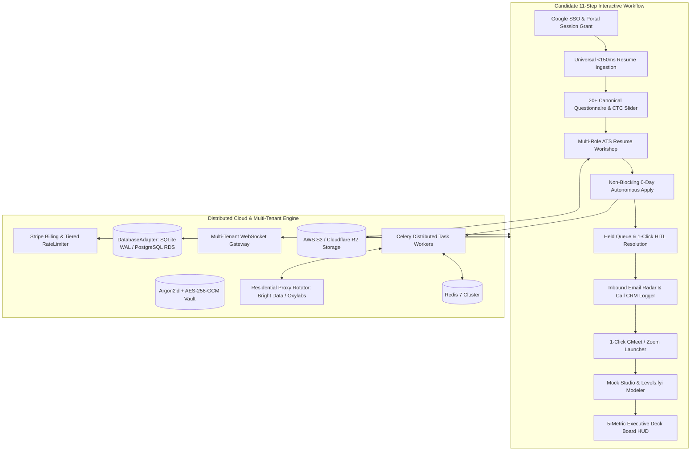

# ⚡ JobCopilot OS

**The Autonomous Career Operating System & Distributed Multi-Tenant SaaS Platform.**

[](https://github.com/satyajit7018/JobCopilot/actions/workflows/ci.yml)
[](https://github.com/satyajit7018/JobCopilot)
[](https://github.com/satyajit7018/JobCopilot)
[](https://opensource.org/licenses/MIT)

JobCopilot eliminates the manual friction of technical job hunting. It continuously discovers 0-day openings across direct ATS APIs, compiles targeted PDF resumes per role, fills multi-step application forms with humanized stealth browser automation, and automatically syncs recruiter feedback into a real-time executive cockpit.

---

## 🌟 Master Architecture & Flow



---

## 🎯 The 11-Step Interactive Candidate Workflow

| Step | Feature | Description |
|:---|:---|:---|
| **1 & 3** | **Google SSO & Portal Permissions** | Google Single Sign-On + auto-login session authorization for Greenhouse, Lever, and Ashby hiring portals. |
| **2** | **Universal Resume Ingestion** | Instant drag-and-drop parser for PDF, DOCX, and TXT with sub-150ms extraction latency. |
| **4** | **20+ Canonical Questionnaire** | Multi-currency CTC live slider, Notice Period, Work Authorization, Visa Sponsorship, Stealth Employer Blacklisting, and `⏭️ Skip & Fill Later`. |
| **5** | **Multi-Role ATS Resume Maker** | Live side-by-side tailored resume variant builder with promoted projects, keyword match badges, and custom bullet reordering. |
| **6 & 7** | **Non-Blocking Apply & Held Queue** | Unindexed questions pause only that specific job and trigger topbar `⏸️ N Held Applications`. 1-click approval submits and indexes Q&As. |
| **8** | **Email Radar & Direct Call Logger** | IMAP IDLE intent classification (Interviews, Assessments, Offers, Rejections) + manual phone screen CRM logger. |
| **9** | **1-Click Video Meeting Launcher** | Extracted meeting links render a direct **`📹 Join Google Meet`** / **`📹 Join Zoom`** button on *Interviewing* cards. |
| **10** | **Career Value Multipliers** | AI Mock Interview Studio, Levels.fyi ESOP valuation modeler, Triple-Threat outreach, and AES-256-GCM encrypted backups. |
| **11** | **Executive Deck Board HUD** | 5-Metric top HUD tracking: *Submitted Applications*, *Recruiter Responses*, *Interviews & Offers*, *Rejections*, and *Conversion Rate %*. |

---

## ☁️ Distributed Multi-Tenant SaaS Features

### 1. Multi-Tenant Security & Isolation
- **Argon2id + JWT Security**: Modern password hashing with cryptographic salt and JWT access/refresh token rotation.
- **Strict Tenant Data Isolation**: All database queries enforce `WHERE user_id = ?` to guarantee zero cross-tenant data leakage.
- **`DatabaseAdapter` Layer**: Seamless switching between local SQLite (with WAL mode + 256MB MMAP) and PostgreSQL (Supabase / AWS RDS).

### 2. Distributed Cloud Architecture
- **Object Storage (`object_storage.py`)**: Unified file driver for Local FileSystem, AWS S3, and Cloudflare R2 with pre-signed secure download URLs.
- **Residential Proxy Rotator (`proxy_rotator.py`)**: Multi-provider residential IP rotation supporting Bright Data, Oxylabs, and custom pools.
- **Celery + Redis Task Engine (`celery_app.py`)**: Distributed asynchronous background task queues with prioritized routing and local in-memory fallback.
- **Multi-Tenant WebSocket Gateway (`ws_gateway.py`)**: Real-time event streams and HITL notifications segmented per `user_id`.

### 3. Monetization & Subscriptions
- **Tiered Rate Limiter (`rate_limiter.py`)**:
  - **`FREE`**: 5 applies/day, standard feeds.
  - **`PRO` ($29/mo)**: 30 applies/day, 0-day priority feeds, triple-threat outreach.
  - **`ELITE` ($79/mo)**: Unlimited applies, residential proxy rotation, priority queue routing.
- **Stripe Billing Integration**: Automated checkout session generator (`POST /api/billing/checkout`) and webhook lifecycle listener (`POST /api/billing/webhook`).

---

## 🚀 Quickstart & Production Deployment

### Local Development Setup

```bash
# 1. Clone repository
git clone https://github.com/satyajit7018/JobCopilot.git
cd JobCopilot

# 2. Set up virtual environment
python3 -m venv backend/venv
source backend/venv/bin/activate
pip install -r backend/requirements.txt

# 3. Start local development server
python -m uvicorn app.main:app --app-dir backend --host 0.0.0.0 --port 8000
```
Open **[http://localhost:8000](http://localhost:8000)** in your browser.

---

### Production Deployment (Docker Compose)

```bash
# 1. Copy environment template
cp .env.production.example .env.production

# 2. Launch production stack
docker-compose -f docker-compose.production.yml up -d --build
```

The production stack orchestrates:
- **`jobcopilot_frontend`** (NGINX Alpine reverse proxy & static SPA on port 80)
- **`jobcopilot_api`** (FastAPI Uvicorn workers on port 8000)
- **`jobcopilot_worker`** (Celery distributed application task workers)
- **`jobcopilot_redis`** (Redis 7 queue broker & cache on port 6379)

---

## 🧪 Testing & Verification

```bash
# Run full 59-test integration test suite
backend/venv/bin/pytest backend/tests/ -v

# Run 30-loop deep subsystem stress audit
backend/venv/bin/python backend/stress_test_30_deep_loops.py
```

---

## 📄 License
MIT License. Built with ❤️ for autonomous career empowerment.
