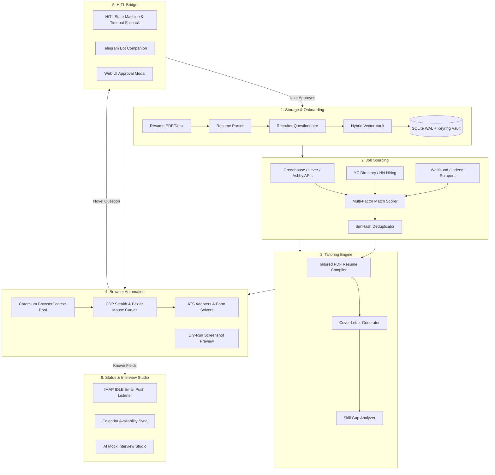

# JobCopilot

**Local-first autonomous job application bot and career copilot.**

JobCopilot automates the tedious parts of job hunting. It monitors job boards and career APIs, compiles targeted PDF resumes per role, fills out multi-page ATS forms using humanized browser automation, handles unfamiliar questions via real-time user prompts, and tracks application statuses directly from your email inbox.

---

## Key Features

- **Self-Learning Knowledge Vault**: When the bot encounters an unindexed form field or custom essay question, it prompts you once (via the web UI or Telegram). Once you approve or edit the answer, it is stored in your local vector vault and reused automatically for future applications.
- **Direct ATS API & 0-Day Sourcing**: Discovers openings directly from Greenhouse, Lever, and Ashby public APIs in under 2 seconds, alongside curated scrapers for Y Combinator (Work at a Startup), Wellfound, and Hacker News hiring threads.
- **Dynamic PDF Resume Generation**: Compiles custom, ATS-parseable PDF resumes tailored to the target job description using Chromium CSS Paged Media—no heavy LaTeX dependencies required.
- **Multi-ATS Browser Worker Pool**: Multi-threaded Playwright workers with adapters for **Greenhouse, Lever, Ashby, Workday, YC, Wellfound, and Indeed**.
- **Anti-Bot Stealth Engine**: Bypasses bot detection using Chrome DevTools Protocol (CDP) evasion (`navigator.webdriver` masking), cubic Bézier mouse movement curves, digraph-based keystroke latency, honeypot input bypass, and canvas signature rendering.
- **Multi-Channel Outreach**: Auto-generates concise, 3-sentence cold emails to engineering leads and LinkedIn connection notes tailored to the role.
- **Real-Time Email Tracking**: Uses IMAP IDLE push listeners to automatically parse application receipts, interview invitations, and status updates directly into a Kanban board.
- **AI Mock Interview Studio**: Generates role-specific technical question sets, company architecture dossiers, and verbal answer scoring.
- **Compensation Benchmarking**: Compares compensation against Levels.fyi percentiles and models startup equity (ESOP) scenarios.
- **100% Local-First & Private**: All data, resumes, and credentials remain encrypted on your local machine using **Argon2id + AES-256-GCM**. Zero cloud dependencies or subscription fees.

---

## Architecture



---

## Tech Stack

| Component | Technology |
|:---|:---|
| **Frontend** | React 18, Vite, Vanilla CSS design tokens (WCAG 2.1 AA) |
| **Backend** | FastAPI (Python 3.11), Uvicorn, Typed JSON-RPC WebSockets |
| **Browser Engine** | Playwright (Chromium BrowserContext pool), Chrome DevTools Protocol |
| **LLM & Embeddings** | Gemini 1.5 Flash (Structured JSON schemas), SentenceTransformers |
| **Vector Search** | Hybrid Reciprocal Rank Fusion (Dense 768d embeddings + BM25 lexical) |
| **Database & Storage** | SQLite (WAL Mode), Content-Addressable Blob Storage (SHA-256) |
| **Security** | Argon2id key derivation, macOS/Linux Keyring, AES-256-GCM |
| **Email Monitor** | Asynchronous IMAP IDLE push listener (`aioimaplib`), Gmail OAuth2 |

---

## Quick Start

### Prerequisites
- Python 3.11+
- Node.js 18+
- Chromium browser binaries (installed automatically via Playwright)

### Installation & Run

1. **Clone the repository**:
   ```bash
   git clone https://github.com/satyajit7018/JobCopilot.git
   cd JobCopilot
   ```

2. **Start the application**:
   ```bash
   ./start.sh
   ```

   Or run via Docker Compose:
   ```bash
   docker-compose up --build
   ```

3. **Onboarding**:
   - Open `http://localhost:5173` in your browser.
   - Upload your resume (PDF or DOCX).
   - Confirm the pre-filled recruiter preferences (salary expectations, work authorization, notice period).
   - Start an automated application session or use **Dry-Run Mode** to preview form fills before submission.

---

## Repository Structure

```
JobCopilot/
├── PLAN.md                           # Master Architecture & Implementation Specification
├── docker-compose.yml                # Docker configuration
├── start.sh                          # One-click startup script
├── backend/
│   ├── app/
│   │   ├── api/                      # REST & WebSocket endpoints
│   │   ├── bot/                      # Playwright worker pool & ATS adapters
│   │   ├── core/                     # Storage, parsers, AI services & models
│   │   └── discovery/                # ATS APIs and job scrapers
│   ├── tests/                        # Pytest test suites & mock ATS server
│   └── requirements.txt
├── frontend/
│   ├── src/
│   │   ├── components/               # React UI components (Kanban, Mini-Browser, Modals)
│   │   ├── pages/                    # Dashboard, JobPipeline, KnowledgeVault, BotConsole
│   │   └── services/                 # API & WebSocket client
│   └── package.json
└── docs/                             # Engineering audits, workforce plans & benchmarks
```

---

## License

MIT License © 2026 Satyajit Nayak
