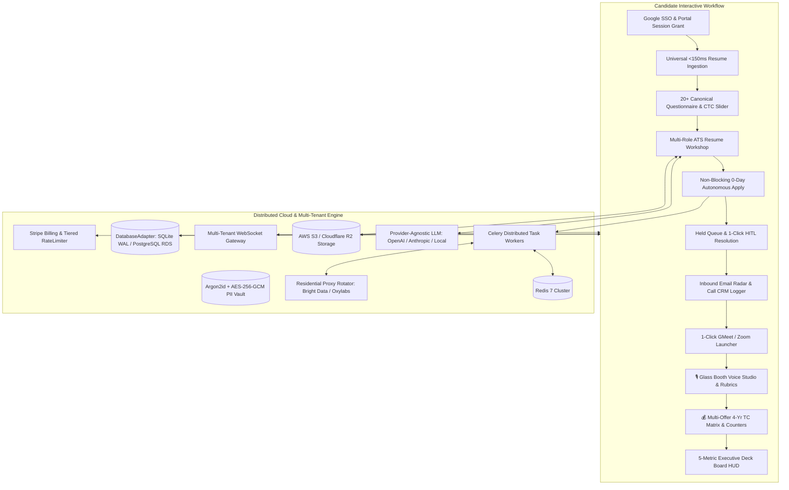

# ⚡ JobCopilot OS

**The Autonomous Career Operating System & Distributed Multi-Tenant SaaS Platform.**

[](https://github.com/satyajit7018/JobCopilot/actions/workflows/ci.yml)
[](https://github.com/satyajit7018/JobCopilot)
[](https://github.com/satyajit7018/JobCopilot)
[](https://github.com/satyajit7018/JobCopilot/blob/main/backend/tests/security/verify_audit_fixes.py)
[-blueviolet.svg)](https://github.com/satyajit7018/JobCopilot)
[](https://github.com/satyajit7018/JobCopilot)
[](https://opensource.org/licenses/MIT)

JobCopilot eliminates the manual friction of technical job hunting. It continuously discovers 0-day openings across direct ATS APIs, compiles targeted PDF resumes per role, fills multi-step application forms with humanized stealth browser automation, provides an AI-powered voice mock interview studio with real-time cadence scoring, and models multi-offer 4-year compensation trajectories.

---

## ⚡ 60-Second Quickstart

Get JobCopilot up and running on your local machine with zero configuration:

### 🐳 Option A: 1-Command Launch with Docker (Recommended)

```bash
# 1. Clone the repository
git clone https://github.com/satyajit7018/JobCopilot.git
cd JobCopilot

# 2. Launch the full-stack container stack
docker compose -f docker-compose.production.yml up -d
```

👉 Open **[http://localhost](http://localhost)** (or `http://localhost:8000`) in your browser.

---

### 🐍 Option B: Run Locally with Python

```bash
# 1. Clone the repository
git clone https://github.com/satyajit7018/JobCopilot.git
cd JobCopilot

# 2. Setup virtual environment & install dependencies
python3 -m venv backend/venv
source backend/venv/bin/activate
pip install -r backend/requirements.txt

# 3. Start the FastAPI development server
python -m uvicorn app.main:app --app-dir backend --host 0.0.0.0 --port 8000
```

👉 Open **[http://localhost:8000](http://localhost:8000)** in your browser.

---

## 🌟 Master Architecture & Flow



---

## 🎯 Candidate Workflow & Features

| Step | Feature | Description |
|:---|:---|:---|
| **1 & 3** | **Google SSO & Portal Permissions** | Google Single Sign-On + auto-login session authorization for Greenhouse, Lever, and Ashby hiring portals. |
| **2** | **Universal Resume Ingestion** | Instant drag-and-drop parser for PDF, DOCX, and TXT with sub-150ms extraction latency. |
| **4** | **20+ Canonical Questionnaire** | Multi-currency CTC live slider, Notice Period, Work Authorization, Visa Sponsorship, Stealth Employer Blacklisting, and `⏭️ Skip & Fill Later`. |
| **5** | **Multi-Role ATS Resume Workshop** | Live side-by-side tailored resume variant builder with promoted projects, keyword match badges, and custom bullet reordering. |
| **6 & 7** | **Non-Blocking Apply & Held Queue** | Unindexed questions pause only that specific job and trigger topbar `⏸️ N Held Applications`. 1-click approval submits and indexes Q&As. |
| **8** | **Email Radar & Direct Call Logger** | Inbound webhook subaddress routing (`radar+usr@jobcopilot.app`) + intent classification + manual phone screen CRM logger. |
| **9** | **1-Click Video Meeting Launcher** | Extracted meeting links render a direct **`📹 Join Google Meet`** / **`📹 Join Zoom`** button on *Interviewing* cards. |
| **10** | **🎙️ Voice Interview Studio & Glass Booth** | Real-time Web Speech API transcription, WPM Cadence Radar, Filler Word Scanner, and STAR scoring rubric in a distraction-free modal. |
| **11** | **💰 Multi-Offer 4-Year TC Modeler** | Side-by-side compensation comparison, equity vesting schedules, and executive anti-AI counter-offer email generator. |
| **12** | **Executive Deck Board HUD** | 5-Metric top HUD tracking: *Submitted Applications*, *Recruiter Responses*, *Interviews & Offers*, *Rejections*, and *Conversion Rate %*. |

---

## 🎙️ Career Acceleration Pillars

### 1. 🎙️ Live Voice-to-Text & Speech Cadence Intelligence
- **Real-Time Web Speech API**: Streams your spoken answers word-by-word directly into the answer box.
- **Cadence & WPM Radar**: Measures speaking speed in real-time (`🟢 145 WPM (Optimal)`, `🟡 100 WPM (Deliberate)`, `🔴 180 WPM (Rushed)`).
- **Filler Word Radar**: Scans for crutches (`"um"`, `"uh"`, `"like"`, `"you know"`, `"actually"`) and calculates a **Delivery Polish Score**.
- **Reverse-Interview Questions Engine**: Generates 3 strategic questions tailored for the hiring manager (Velocity & Tech Debt, Production On-Call & Reliability, 90-Day Success Metrics).

### 2. 💰 Multi-Offer Comparison Matrix & Counter-Offer Generator
- **Side-by-Side 4-Year TC Growth**: Models Base Salary + Performance Bonus + Equity (RSU vs Options) + Sign-on across 4 years.
- **Executive Counter-Offer Email & Script Generator**: Produces Anti-AI sanitized executive counter emails and structured phone negotiation talking points with 1-click clipboard copy.

### 3. 🕵️ Interviewer Persona Sleuth & Engineering Tech Blog Intel
- **Persona Profiler**: Classifies interviewer styles (Bar Raiser / Amazonian Assessor, Staff+ Systems Architect, Engineering Manager / Team Multiplier, Peer Programmer) and generates tailored response tactics.
- **Engineering Tech Intel**: Pre-seeded deep architecture initiatives across Stripe (Envoy, Sorbet), Uber (H3, Schemaless), Netflix (Titus, Chaos Monkey), Meta (TAO, PyTorch), and OpenAI (Triton, GPU clusters).

### 4. ⚡ High-Velocity Referral & Recruiter Nudge Engine
- **Alumni Referral Pitch Generator**: Formulates high-converting 280-character LinkedIn connection notes and structured cold emails.
- **5-Day Recruiter Follow-Up Nudge**: Crafts value-add follow-up templates referencing recent technical accomplishments.

### 5. 🎮 Distraction-Free "Glass Booth" & Procedural Audio Chimes
- **Glass Booth Modal (`#glass-booth-modal`)**: Full-screen cockpit with backdrop blur, waveform canvas, prompter cards, live rubric notes, and instant `ESC` exit.
- **Procedural Synthesizer Chimes**: Web Audio API harmonic sound effects (`'success'`, `'celebrate'`, `'tap'`) with zero external MP3 dependencies.

---

## ☁️ Distributed Multi-Tenant SaaS Features

### 1. Multi-Tenant Security & Defense-in-Depth
- **Argon2id + Session-Bound JWTs**: Modern password hashing with cryptographic salt. Access and refresh tokens share a session id (`sid`), so logout, password reset, and "log out everywhere" revoke refresh tokens too — no orphaned long-lived tokens.
- **Transparent PII Encryption at Rest**: Sensitive candidate fields (phone, compensation expectations, current employer, location) are encrypted with AES-256-GCM. The KEK salt is derived from the master key so replicas can decrypt each other's data.
- **Security Headers & CSP Middleware**: Full Content Security Policy, HSTS, `X-Frame-Options: DENY`, `X-Content-Type-Options: nosniff`, and slowapi brute-force lockout.
- **Strict Tenant Data Isolation**: All database queries enforce `WHERE user_id = ?` to guarantee zero cross-tenant data leakage. Real-time WebSocket broadcasts require a `user_id` and never fan out to every socket.
- **GDPR Article 17 Right-to-Erasure**: `hard_delete_user_account()` purges every user-scoped table (both SQLite and PostgreSQL adapters at parity) plus S3/R2 and local object storage; `security_audit_logs` and `user_consents` are intentionally retained under Art. 17(3).

### 2. Distributed Cloud Architecture & Providers
- **Provider-Agnostic LLM Engine (`llm_client.py`)**: Seamless support for OpenAI, Anthropic Claude, and 100% offline rule-based deterministic fallback.
- **Inbound Email Webhook Radar (`inbound_provider.py`)**: Subaddress tenant attribution (`radar+usr_123@jobcopilot.app`) with HMAC-SHA256 signature verification.
- **Object Storage (`object_storage.py`)**: Unified file driver for Local FileSystem, AWS S3, and Cloudflare R2 with pre-signed secure download URLs.
- **Residential Proxy Rotator (`proxy_rotator.py`)**: Multi-provider residential IP rotation supporting Bright Data, Oxylabs, and custom pools.
- **Celery + Redis Task Engine (`celery_app.py`)**: Distributed asynchronous background task queues with prioritized routing and local in-memory fallback.
- **Multi-Tenant WebSocket Gateway (`ws_gateway.py`)**: Real-time event streams and HITL notifications segmented per `user_id`.

### 3. Monetization & Subscriptions
- **Tiered Rate Limiter (`rate_limiter.py`)**:
  - **`FREE`**: 5 applies/day, standard feeds.
  - **`PRO` ($29/mo)**: 30 applies/day, 0-day priority feeds, triple-threat outreach.
  - **`ELITE` ($79/mo)**: Unlimited applies, residential proxy rotation, priority queue routing.
- **Stripe Billing Integration**: Real Stripe Checkout Session creation (`POST /api/billing/checkout`), Customer Portal sessions (`POST /api/billing/portal`), and webhook lifecycle listener (`POST /api/billing/webhook`). Webhooks resolve users by stored Stripe customer id, derive tier from price id + status, validate redirect URLs, and never overwrite an `ADMIN` role.

---

## 🛡️ September 2026 Security Audit — Hardened

A full security audit was applied and verified; all 21 audited exploits are closed. Highlights:

- **Fail-closed inbound email**: the webhook rejects unsigned requests, routes mail only by the verified recipient subaddress, and production refuses to boot without `INBOUND_EMAIL_WEBHOOK_SECRET`.
- **Google SSO hardening**: requires `email_verified`, takes the email only from the verified token, and goes through the same MFA gate as password login (no SSO bypass).
- **Stored XSS closed**: toasts and terminal logs build DOM nodes via `textContent`; remaining server/LLM-sourced strings are escaped.
- **Idempotent, honest apply flow**: async apply runs the real bot and reports its true result; a unique `apply_ledger(user_id, job_id)` index + atomic compare-and-set (`transition_ledger_status`) makes concurrent/retried applies race-free; nothing is marked `SUBMITTED` without a detected confirmation, and `LIVE` mode requires explicit consent.
- **Locked-down ops endpoints**: `/metrics` requires `METRICS_TOKEN` (404 in production without one) and `/health` no longer leaks exception text; org invites cannot escalate to `OWNER`.
- **Regression harness**: `backend/tests/security/verify_audit_fixes.py` re-runs all 21 exploits and exits non-zero if any reopen.

### Engineering Rigor
- **Single DB contract**: `db_adapter.py` defines a `DatabaseAdapter` ABC; the SQLite (`database.py`) and PostgreSQL (`postgres_adapter.py`) implementations are held at parity by `tests/test_db_adapter_parity.py`.
- **Linear Alembic migrations** (`001 → 005`) with a dedicated CI job that spins up real Postgres 16, asserts a single head, and runs an upgrade + downgrade round-trip.
- **Concatenate-then-minify frontend build** (`frontend/build.js`, esbuild): content-hashed bundle + a source-hash freshness manifest that CI enforces, so a stale bundle fails the build.
- **Demo Mode boundary**: sample-data seeding is gated out of production; the UI shows a Demo Mode banner only when `/auth/public-config` reports `demo_enabled`.

---

## 🧪 Testing & Verification

> The suite targets **Python 3.11**. Set `PYTHONPATH=backend` so `app` imports resolve.

```bash
# Full automated suite (274 tests) in parallel
PYTHONPATH=backend pytest backend/tests -n auto -q

# Re-run all 21 security-audit exploits (must end with "0 open issue(s)")
cd backend && PYTHONPATH=. python tests/security/verify_audit_fixes.py

# Static analysis gate (matches CI)
bandit -r backend/app -ll

# Rebuild the frontend bundle after any JS edit (CI fails on a stale bundle)
cd frontend && npm ci && npm run build

# Frontend end-to-end + accessibility (axe-core, fails on serious/critical WCAG issues)
cd frontend/e2e && npm ci && npx playwright install --with-deps chromium && npx playwright test

# 30-loop deep subsystem stress audit
backend/venv/bin/python backend/stress_test_30_deep_loops.py
```

**CI (`.github/workflows/ci.yml`)** runs three jobs on every push/PR: `test` (pytest coverage gate + Bandit/Semgrep SAST), `e2e` (bundle-freshness check + Playwright + axe-core a11y), and `migrations` (Postgres 16 upgrade/downgrade round-trip).

---

## 🚀 Production Deployment

Before opening the app to real traffic, set these and run migrations:

```bash
# Required secrets (the app fails closed without the email secret)
export INBOUND_EMAIL_WEBHOOK_SECRET=...    # app refuses to start in prod without it
export METRICS_TOKEN=...                    # Prometheus must send it as a Bearer token
export STRIPE_PRO_PRICE_ID=price_...        # real Stripe price ids
export STRIPE_ELITE_PRICE_ID=price_...

# Apply the schema (adds users.stripe_customer_id, etc.)
cd backend && alembic upgrade head
```

See [`.env.production.example`](.env.production.example) for the full configuration surface. Note: after deploying the session-bound-token change, **all users must sign in once more**.

```bash
# Run full automated test suite
backend/venv/bin/pytest backend/tests/ -v

# Run 30-loop deep subsystem stress audit
backend/venv/bin/python backend/stress_test_30_deep_loops.py
```

---

## 📄 License
MIT License. Built with ❤️ for autonomous career empowerment.
