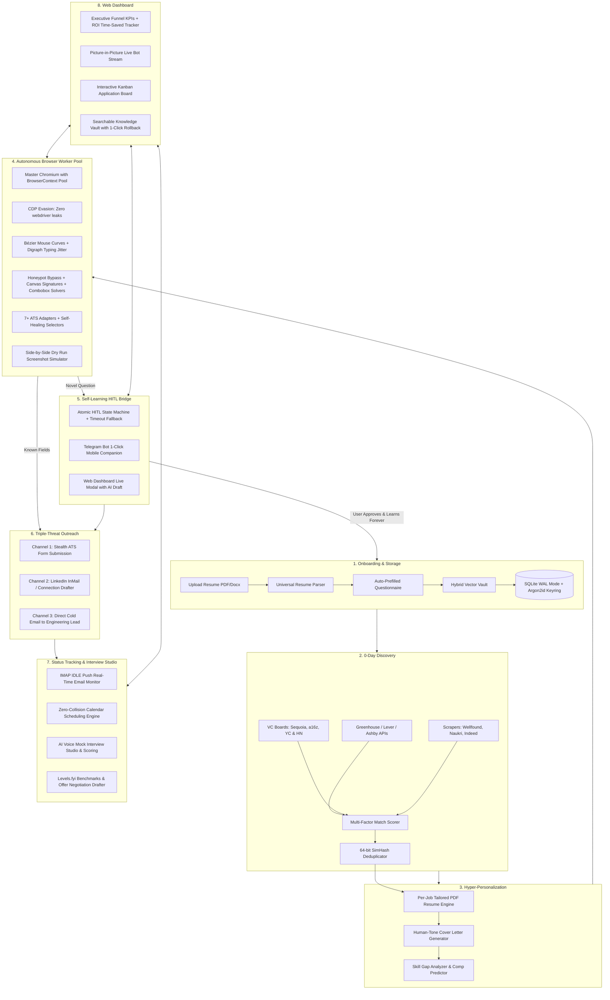

# 🚀 JobCopilot

**The Universal Autonomous Job Hunting, Self-Learning Application & Career Operating System**

JobCopilot is a local-first, autonomous multi-ATS career platform. It discovers 0-day job openings, compiles bespoke tailored PDF resumes per application, fills and submits complex ATS forms with human-like anti-bot stealth, reaches out to hiring managers across multiple channels, learns novel questions permanently via a real-time HITL bridge, and tracks interview pipelines with AI coaching co-pilots.

---

## ✨ Key Capabilities

- **🧠 Self-Learning Knowledge Vault** — When an unfamiliar question appears, JobCopilot prompts you once with a human-tone AI draft (in-app or on Telegram), saves your approved answer into permanent semantic vector slots, and **never asks again**.
- **⚡ 0-Day Omnipresent Job Discovery** — Real-time high-speed sourcing from direct ATS REST APIs (Greenhouse, Lever, Ashby), VC portfolio boards (Sequoia, a16z, YC Directory), and HackerNews "Who is Hiring?" threads.
- **📄 Dynamic Per-Job Tailored Resumes** — Compiles a tailored, pixel-perfect PDF resume matching the target job description's exact technical emphasis using native Chromium CSS Paged Media (zero heavy 4GB LaTeX downloads).
- **🤖 Autonomous Multi-ATS Browser Worker Pool** — Concurrent Playwright workers with specialized adapters for **Greenhouse, Lever, Ashby, Workday, YC WorkAtAStartup, Wellfound, Indeed**, and generic ATS portals.
- **🛡️ Anti-Bot Stealth & Trap Evasion** — Chrome DevTools Protocol (CDP) evasion (`navigator.webdriver` masking), cubic Bézier mouse physics, digraph inter-key typing latency, honeypot form field bypass, and canvas digital signatures.
- **🚀 The "Triple-Threat" Multi-Channel Outreach** — Auto-submits the official ATS form, drafts a personalized 280-character LinkedIn InMail connection note to the hiring manager, and generates a direct 3-sentence cold email to the engineering lead.
- **📬 Real-Time Email Push & Calendar Sync** — IMAP IDLE push monitor automatically tracks confirmation receipts, rejection letters, and interview invites, synchronizing status to an interactive Kanban CRM.
- **🎙️ Voice AI Mock Interview Studio** — Conducts voice-enabled technical and behavioral practice sessions with role-specific question scoring and instant feedback.
- **💰 Salary Negotiation & Comp Benchmarks** — Live compensation percentiles from Levels.fyi, startup ESOP equity modeling, and data-backed counter-offer negotiation scripts.
- **🔒 100% Local-First & Free** — All PII, resumes, and credentials stay securely encrypted on your local machine with **Argon2id + AES-256-GCM**. Zero cloud subscription fees.

---

## 🏗️ System Architecture



---

## 🛠️ Tech Stack

| Layer | Technology |
|:---|:---|
| **Frontend** | React 18 + Vite + Vanilla CSS (Dark/Light Design System, WCAG 2.1 AA) |
| **Backend & API** | FastAPI (Python 3.11) + Typed JSON-RPC WebSockets + Uvicorn |
| **Browser Engine** | Playwright + Master Chromium Context Pooling + CDP Stealth Scripts |
| **AI & LLM** | Gemini 1.5 Flash (Structured JSON Mode) + Anti-AI Authenticity Filters |
| **Vector Search** | Hybrid Reciprocal Rank Fusion (RRF: Dense 768-dim + BM25 Lexical) |
| **Storage & CAS** | SQLite (WAL Mode) + SHA-256 Content-Addressable Blob Storage |
| **Security & Auth** | Argon2id Key Derivation + OS Keychain (`keyring`) + AES-256-GCM |
| **Email Protocol** | Asynchronous IMAP IDLE Push Listener (`aioimaplib`) + Gmail OAuth2 |
| **Mobile Bridge** | Telegram Bot Companion with Inline Quick-Reply Actions |

---

## 🚀 Quick Start

### Prerequisites
- Python 3.11+
- Node.js 18+
- Chromium browser binaries (installed automatically via Playwright)

### 1. Launch JobCopilot
```bash
./start.sh
```

Or using Docker Compose:
```bash
docker-compose up --build
```

### 2. The 2-Minute Setup Flow
1. **Upload Resume**: Upload your existing PDF or DOCX resume. The system auto-extracts your skills, experience, and education.
2. **Confirm Questionnaire**: The 8 baseline recruiter questions open pre-filled for a 30-second review.
3. **Start Autopilot**: Click **Start Auto-Apply** or run in **Dry-Run Mode** to preview applications before submission.

---

## 📚 Documentation & Specifications

Detailed architectural specifications, audits, and competitor benchmarks are available in the project documentation:
- 👑 **[PLAN.md](PLAN.md)** — Master Architecture, Workforce Matrix & Implementation Plan
- 📋 **[docs/implementation_plan.md](docs/implementation_plan.md)** — 8-Milestone Production Blueprint
- ⏱️ **[docs/project_time_and_workforce_estimation.md](docs/project_time_and_workforce_estimation.md)** — Time & AI Workforce Estimates
- 🛡️ **[docs/system_audit_report.md](docs/system_audit_report.md)** — System Architecture & Security Audit
- 🌐 **[docs/ecosystem_competitive_landscape.md](docs/ecosystem_competitive_landscape.md)** — 20+ Competitor Benchmark
- ⚔️ **[docs/competitive_analysis.md](docs/competitive_analysis.md)** — Head-to-Head Comparative Analysis

---

## 📄 License

MIT License © 2026 Satyajit Nayak
