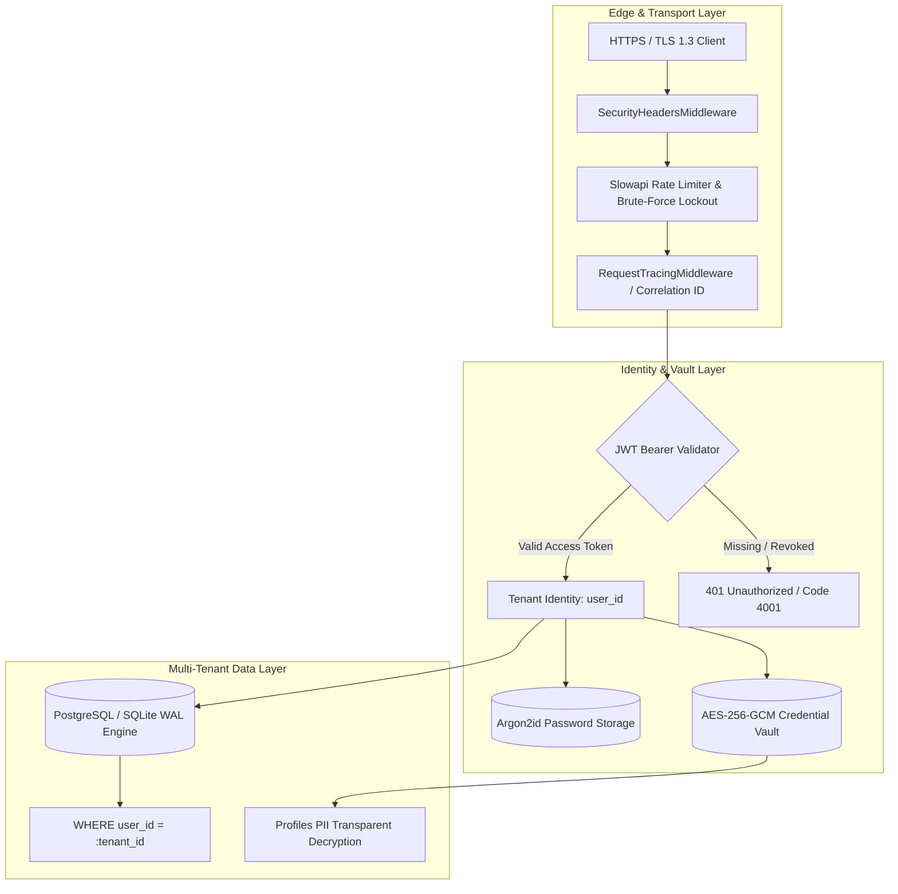

# 🛡️ JobCopilot Security Policy & Architecture

**Last Updated:** August 31, 2026  
**Version:** 1.0.0

JobCopilot implements Defense-in-Depth security engineering across authentication, storage encryption, HTTP transmission, database multi-tenancy, and runtime container sandboxing.

---

## 1. Security Architecture & Threat Model

---

## 2. Cryptographic Standards

| Mechanism | Implementation | Standard / Parameters |
|:---|:---|:---|
| **Password Hashing** | Argon2id | Memory: 64MB, Iterations: 3, Parallelism: 4 |
| **Data Encryption at Rest** | AES-256-GCM | 96-bit random nonce, 128-bit authentication tag |
| **Token Signatures** | HMAC-SHA256 | 32-byte secret key with strict expiration (`exp`) & `jti` |
| **WebSockets** | JWT Token Auth | Connection closed with `code=4001` on invalid/revoked token |
| **Webhooks** | HMAC-SHA256 | Signature check on `X-JobCopilot-Signature` |

---

## 3. Defense-in-Depth HTTP Security

The application applies strict HTTP response headers on all routes:
- **`Content-Security-Policy`**: Restricts scripts to `'self'`, styles to Google Fonts & `'self'`, and connections to `'self'`, WebSocket (`ws:`, `wss:`).
- **`Strict-Transport-Security`**: `max-age=31536000; includeSubDomains; preload` in production.
- **`X-Frame-Options`**: `DENY` to prevent clickjacking.
- **`X-Content-Type-Options`**: `nosniff` to prevent MIME-confusion attacks.
- **`Permissions-Policy`**: Disables access to camera, microphone, and geolocation on backend APIs.

---

## 4. Brute-Force & Rate-Limiting Defenses

- **Slowapi IP Rate Limiting**: Auth endpoints are restricted to `5/minute` to mitigate automated credential stuffing.
- **Account Lockout**: After 5 consecutive failed login attempts within 15 minutes, the account and originating IP are temporarily locked for 15 minutes.
- **Password Strength Policy**: Minimum 12 characters required for all user passwords.

---

## 5. Reporting a Security Vulnerability

We welcome security audits and coordinated disclosure from the community. If you discover a vulnerability:
1. **Do not open a public GitHub issue.**
2. Email full reproduction details, proof-of-concept scripts, and impact analysis to: **security@jobcopilot.local**.
3. We will acknowledge receipt within 24 hours and provide regular remediation updates.
