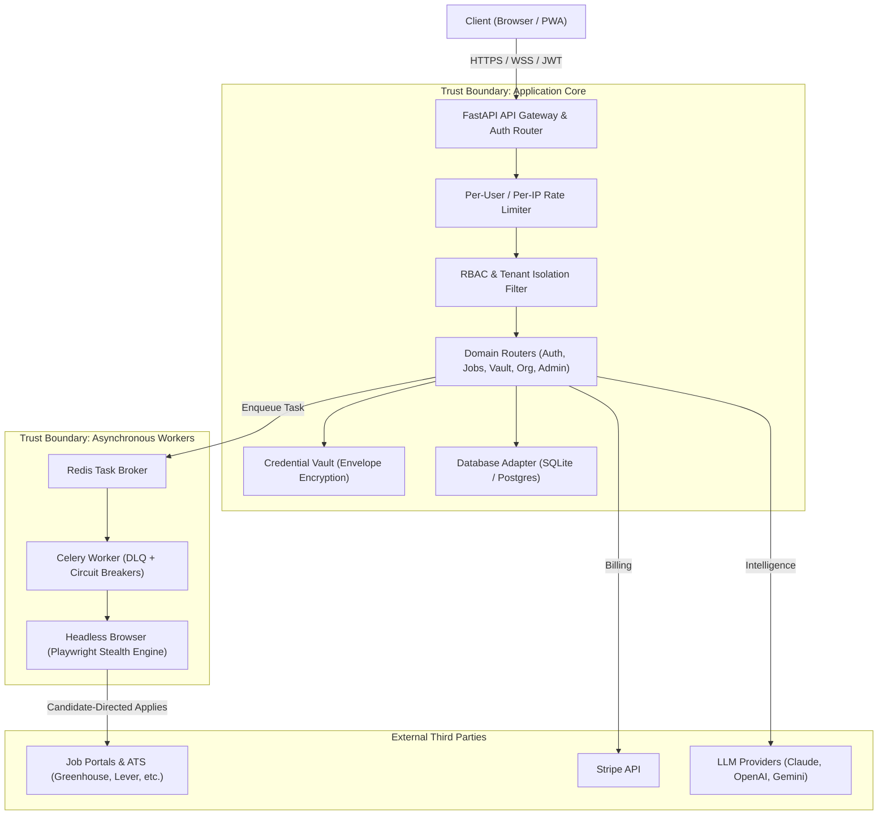

# JobCopilot Threat Model & Security Posture Document
**Document Version:** 2.0 (Phase P2 Epic F)  
**Classification:** Internal Technical Architecture & Compliance Decision Record  
**Status:** Approved & Enforced  

---

## 1. Executive Summary & Scope

JobCopilot is a multi-tenant AI-driven career acceleration and job application orchestration platform. The system operates across:
- A responsive frontend and Progressive Web App (PWA).
- A Python FastAPI application server with JWT-based multi-tenant authentication and RBAC.
- Asynchronous distributed task workers (Celery + Redis) managing AI generation and browser automation.
- Dual-mode data persistence (SQLite WAL for local-first single-tenant runs, PostgreSQL for cloud multi-tenancy).
- Cryptographic credential and PII vault using envelope encryption (AES-256-GCM / Argon2id).
- Headless browser automation engine (Playwright) interacting with third-party ATS platforms.

This document executes a formal **STRIDE** threat model pass across the multi-tenant SaaS architecture and documents an explicit architectural and legal posture regarding browser automation and third-party Terms of Service.

---

## 2. System Architecture & Trust Boundaries

---

## 3. STRIDE Threat Analysis

### 3.1 Spoofing (Identity & Authenticity)
| Threat ID | Description | Impact | Mitigations in Codebase |
| :--- | :--- | :--- | :--- |
| **S-01** | Forged JWT access token via weak secret or `alg: none` attack. | Critical | Fail-closed validation in `auth.py`: production mandates cryptographically secure secrets `>= 32 bytes`. Alg restricted to `HS256`. |
| **S-02** | Hijacked user session via stolen bearer token. | High | **User Sessions Table (`user_sessions`)**: Real-time session listing and remote revocation. Tokens revoked immediately via `revoked_tokens` blacklist. |
| **S-03** | Stolen candidate password used to log in. | High | **MFA / TOTP Engine (`mfa.py`)**: RFC 6238 TOTP enrollment and login challenge gate with single-use backup recovery codes. |
| **S-04** | Spoofed external webhooks (e.g. Stripe billing). | High | Webhook signature verification in `billing_router.py` with secret validation before processing subscription events. |

---

### 3.2 Tampering (Data Integrity)
| Threat ID | Description | Impact | Mitigations in Codebase |
| :--- | :--- | :--- | :--- |
| **T-01** | SQL Injection via user-supplied search parameters or profile inputs. | Critical | 100% parameterized SQL queries across SQLite (`database.py`) and PostgreSQL (`postgres_adapter.py`). No raw string formatting in SQL. |
| **T-02** | Replay of idempotent API mutation requests (e.g. duplicate billing, multi-apply). | Medium | **Idempotency Middleware (`idempotency.py`)**: Request hash verification, atomic locking in `idempotency_keys`, replay of cached responses. |
| **T-03** | Cross-tenant ledger alteration or checkpoint tampering. | High | Compound indexed queries enforcing `WHERE user_id = ?` on every read and write. Tenant isolation asserted in `test_security_tenant_isolation.py`. |
| **T-04** | Tampering with cryptographic Master Keys. | Critical | Keys stored in OS Keychain (`keyring`) or protected keystores with `0600` permissions. |

---

### 3.3 Repudiation (Non-Deniability)
| Threat ID | Description | Impact | Mitigations in Codebase |
| :--- | :--- | :--- | :--- |
| **R-01** | User denies performing destructive action or administrative account change. | Medium | **Append-Only Security Audit Log (`security_audit_logs`)**: Captures actor `user_id`, `event_type`, `ip_address`, `user_agent`, and ISO-8601 timestamp. Table prohibits updates/deletions. |
| **R-02** | Administrator denies impersonating candidate account. | High | **Admin Audit Trail (`admin_audit_logs`)**: Records `admin_id`, `target_user_id`, IP, and exact action. Impersonated JWT tokens carry `impersonated_by` claim. |
| **R-03** | Bot application dispatch deniability. | Low | **Apply Ledger (`apply_ledger`)**: Append-only status tracking for every auto-apply attempt with checkpoint logs and timestamped task IDs. |

---

### 3.4 Information Disclosure (Confidentiality)
| Threat ID | Description | Impact | Mitigations in Codebase |
| :--- | :--- | :--- | :--- |
| **I-01** | Database compromise exposing candidate phone numbers, addresses, salaries. | Critical | **Envelope Encryption (`credential_vault.py`)**: Field-level encryption with ephemeral Data Encryption Keys (DEKs) wrapped under versioned Master Keys (`env:v1:...`). |
| **I-02** | Stored platform passwords or cookies leaked in plaintext. | Critical | Vault encrypted at rest via AES-256-GCM and Argon2id key derivation (`vault.enc`). |
| **I-03** | Cross-tenant data leakage in API responses or cache. | High | Redis cache keys partitioned with explicit tenant prefixes (`tenant:{user_id}:*`). |
| **I-04** | Leaked secrets in git repositories or CI artifacts. | High | **Gitleaks** secret scanning enforced in CI pipeline alongside Bandits SAST scanning. |

---

### 3.5 Denial of Service (Availability)
| Threat ID | Description | Impact | Mitigations in Codebase |
| :--- | :--- | :--- | :--- |
| **D-01** | Brute-force credential stuffing against `/auth/login`. | High | 15-minute brute-force lockout (`login_attempts`) + **Anomaly Alerts (`anomaly.brute_force`)** triggered upon 5 failed attempts in 5 minutes. |
| **D-02** | API resource flooding by authenticated tenants. | Medium | **Per-User Rate Limiting**: SlowAPI keyed by authenticated user ID (`usr:<user_id>`), preventing distributed IP proxy bypass. |
| **D-03** | Downstream ATS or LLM outages hanging worker threads. | High | **Circuit Breaker Pattern (`circuit_breaker.py`)**: Trips open on consecutive errors, failing fast and protecting worker thread capacity. |
| **D-04** | Worker task death causing lost or infinite retry jobs. | Medium | **Celery Dead-Letter Queue (DLQ)** with exponential backoff and maximum retry limits (`celery_app.py`). |

---

### 3.6 Elevation of Privilege (Authorization)
| Threat ID | Description | Impact | Mitigations in Codebase |
| :--- | :--- | :--- | :--- |
| **E-01** | Candidate self-upgrading subscription or role to `ADMIN`. | Critical | FastAPI RBAC dependencies (`require_admin`) enforce database-verified role checking. Self-service profile updates cannot mutate `role`. |
| **E-02** | User accessing or mutating resources of another organization. | High | Org membership dependency (`require_org_admin`, `require_org_owner`) verifies active membership records in `memberships` table. |

---

## 4. Headless Stealth Browser Automation: Legal & Ethical Posture

### 4.1 Problem Statement & Context
JobCopilot assists candidates by automating repetitive form-filling tasks on public ATS job boards (e.g. Greenhouse, Lever, Workday, Indian job portals). Job boards and employers utilize various anti-bot solutions (Cloudflare Turnstile, PerimeterX, reCAPTCHA) and standard Terms of Service (ToS) clauses regarding automated access.

### 4.2 Architecture Decision & Operating Principles
The JobCopilot steering team has established the following binding architectural and ethical operating boundaries:

1. **Candidate-Directed Agency**:
   - The automation agent operates strictly as a technological tool on behalf of, and with the explicit direction of, the individual candidate.
   - The candidate owns their resume, answers, and data. The bot is an assistive proxy, analogous to a specialized web browser extension or autofill utility.

2. **No Circumvention of Access Controls / No Security Breach**:
   - The platform interacts exclusively with **publicly exposed job application endpoints** designed for candidate submissions.
   - The bot **does not** access restricted employer dashboards, private networks, or unauthorized systems.

3. **Human-in-the-Loop (HITL) Safeguards**:
   - The system **never** automates legal affirmations, non-disclosure agreements, immigration work authorization assertions, or salary negotiations without explicit candidate review.
   - Any ambiguous question or high-stakes field triggers a WebSocket HITL event (`hitl_events`), halting browser automation until the candidate approves or fills the field directly.

4. **Polite, Non-Denial-of-Service Rate Limits**:
   - Concurrency is hard-capped at **1 concurrent active application task per candidate**.
   - Keystroke dynamics and mouse movements mimic human speeds (50ms–200ms randomized intervals).
   - Daily application caps are strictly enforced according to subscription tier (Free: 5/day, Pro: 30/day).
   - The bot adheres to ATS request limits to ensure zero infrastructure burden on hiring companies.

5. **Transparency & User Accountability**:
   - The application ledger records an auditable trail of every interaction, submission, and confirmation email for the candidate's inspection.

### 4.3 Sign-Off & Governance
This policy represents the explicit, documented decision of the engineering and product governance team. Revisions to stealth bypass heuristics must preserve the ethical principles of candidate agency, polite rate limiting, and mandatory HITL escalation.

---

## 5. Security Verification & CI Continuous Assurance

Security posture is validated continuously through automated CI quality gates:
1. **Gitleaks**: Scans commit history for high-entropy tokens, AWS/Stripe keys, and hardcoded secrets.
2. **Bandit SAST**: Scans `backend/app` for insecure function calls, weak crypto, and SQL injection flaws (0 High, 0 Medium permitted).
3. **Semgrep SAST**: Performs semantic analysis for security anti-patterns across API handlers.
4. **Pytest Regression & Coverage Gate**: Enforces minimum 80% test coverage with dedicated security suites (`test_security_epic_f.py`, `test_security_tenant_isolation.py`, `test_auth_advanced.py`).
5. **Pip-Audit & Dependabot**: Automated weekly scanning and dependency update PRs for known CVEs.
