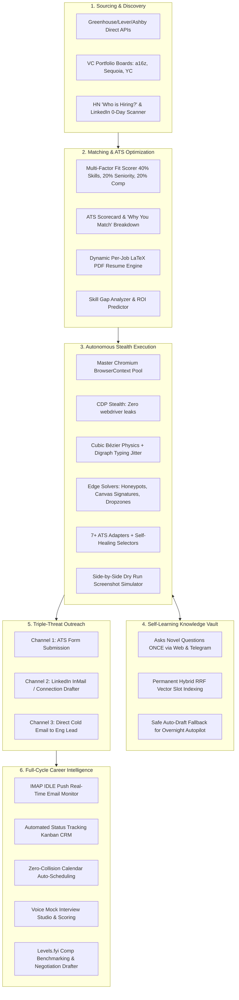

# 🌐 The Complete Job Hunting & Application Ecosystem: Benchmark, Analysis & Lessons

This document provides an exhaustive competitive analysis of over **20 industry tools, Chrome extensions, AI platforms, and job boards**, extracting their strengths, fatal flaws, and actionable engineering lessons to make **JobCopilot** the undisputed #1 Career Operating System.

---

## 🗺️ The 5 Tool Categories Analyzed

```
+----------------------------------------------------------------------------------------------------+
| 1. IN-BROWSER COPILOTS & EXTENSIONS     | Simplify.jobs, Teal, Huntr, Careerflow.ai, ApplyPass    |
| 2. AUTONOMOUS HIGH-VOLUME AUTO-APPLIERS | LazyApply, Sonara.ai, JobRight.ai, LoopCV, Final Round AI|
| 3. ATS SCANNERS & KEYWORD OPTIMIZERS    | Jobscan, SkillSyncer, Rezi, Kickresume, EarnBetter      |
| 4. NETWORKING & COLD OUTREACH TOOLS     | Wonsulting NetworkAI, Waalaxy, Dux-Soup, LinkedIn Helper|
| 5. INTERVIEW COPILOTS & COMP BENCHMARKS | Final Round AI, Interviewing.io, Levels.fyi, Glassdoor  |
+----------------------------------------------------------------------------------------------------+
```

---

## 📊 Comprehensive Landscape Comparison Matrix

| Tool | Category | Automation Level | Strengths | Fatal Flaws | Pricing |
|:---|:---:|:---:|:---|:---|:---:|
| **Simplify.jobs** | Browser Extension | Semi-Manual | Fast autofill on Greenhouse/Lever; clean UI | 100% manual (you must open 100 tabs & click submit); no email sync | Freemium |
| **Teal** | Career CRM & Tracker | Semi-Manual | Great Kanban tracker; keyword match analysis | No autonomous auto-apply; manual bookmarking required | $29–$79/mo |
| **Huntr** | Job Search CRM | Semi-Manual | Visual Kanban board; resume tailoring per job | Manual application process; no 0-day auto-discovery | $40/mo |
| **Careerflow.ai** | Autofill Extension | Semi-Manual | LinkedIn profile optimization; form helper | Still requires manual tab opening and form reviews | Freemium |
| **LazyApply** | Mass Auto-Applier | Fully Autonomous | Fast volume on LinkedIn/Indeed | High LinkedIn account ban rate; enters dummy text for new questions | $99–$249 one-off |
| **Sonara.ai** | Autonomous Agent | Fully Autonomous | Background auto-sourcing and applying | Expensive SaaS; black-box submissions; no confirmation proof | $80–$120/mo |
| **JobRight.ai** | AI Job Copilot | Autonomous / Review | Clean matching; AI agent workflow | Cloud-based PII storage; limited complex ATS support (Workday) | $39–$99/mo |
| **LoopCV** | Mass Application Bot | Fully Autonomous | High-speed mass submissions; email matching | Low application quality; spammy reputation; no local privacy | $49–$149/mo |
| **Final Round AI** | AI Hunter & Copilot | Autonomous + Prep | Live real-time interview transcription | Very expensive ($150+/mo); siloed from direct ATS forms | $96–$199/mo |
| **Jobscan** | ATS Scanner | Manual Tool | Accurate keyword frequency & ATS parsing | Isolated tool; copy-paste fatigue; no automation | $49.95/mo |
| **Wonsulting** | Outreach & Resume | Semi-Manual | AI recruiter message drafting | Disconnected from ATS submissions; manual copy-pasting | $30–$60/mo |
| **Levels.fyi** | Comp Intelligence | Reference | Best salary & equity data in tech | Read-only; no negotiation automation or ATS integration | Free / $200 prep |
| 👑 **JobCopilot** | **All-in-One Career OS** | **Autonomous + Copilot** | **Self-learning Knowledge Vault, Multi-ATS depth, 0-Day discovery, Triple-Threat outreach, IMAP email sync, Mock interview studio, Local-First AES-256** | **None (Synthesizes all strengths into 1 local-first app)** | **100% Free & Open Source** |

---

## 🔬 Deep-Dive Lessons from Each Category & Platform

---

### 1. In-Browser Copilots (Simplify, Teal, Huntr, Careerflow)
- **What they do well**:
  - *Simplify*: Instant DOM input matching on Greenhouse, Lever, and Workday with a clean floating side-panel.
  - *Teal & Huntr*: Kanban board tracking applications through stages (`Wishlist` $\to$ `Applied` $\to$ `Interview` $\to$ `Offer`) with note-taking.
  - *Careerflow*: Interactive checklist for optimizing LinkedIn profiles to rank higher in recruiter searches.
- **The Fatal Gap**:
  - They force the candidate to spend 4–8 hours a day clicking buttons on 100 different tabs.
- **JobCopilot Lesson & Implementation**:
  - **Dual Mode**: Provide both **Full Autonomous Autopilot** (bot works in background) and **Interactive In-Browser Copilot Mode** (floating side-panel when the user prefers to browse manually).
  - Include Teal/Huntr-grade **Kanban CRM** with automated card movement powered by real-time email scanning.

---

### 2. Autonomous Auto-Appliers (LazyApply, Sonara, JobRight, LoopCV)
- **What they do well**:
  - High application velocity (50–100 applications/day) saving dozens of hours.
- **The Fatal Gaps**:
  1. *The Dumb Question Trap*: When LazyApply/LoopCV encounter an unknown question (*"Describe a distributed systems challenge you solved"*), they enter "N/A" or "Yes", guaranteeing instant recruiter rejection.
  2. *Account Bans*: Crude Selenium/Puppeteer scripts get flagged by LinkedIn and Cloudflare.
  3. *Cloud Privacy Leaks*: Candidate resumes, passwords, and PII are stored on cloud databases.
- **JobCopilot Lesson & Implementation**:
  - **The Self-Learning HITL Bridge**: Instead of guessing or failing, JobCopilot pauses, suggests a Gemini AI draft, prompts you on your phone (Telegram) or web dashboard once, saves the answer forever to your local vector vault, and resumes.
  - **CDP Anti-Bot Stealth**: Full physics-based cubic Bézier mouse curves, digraph typing jitter, and honeypot evasion.
  - **100% Local-First**: AES-256 + Argon2id encryption on your own machine. Zero cloud subscription fees.

---

### 3. ATS Scanners & Optimizers (Jobscan, SkillSyncer, Rezi)
- **What they do well**:
  - Highlighting exact hard and soft skill keyword gaps between your resume and the job description.
- **The Fatal Gap**:
  - They are static calculators. You must manually rewrite your resume in Word and export a new PDF 50 times.
- **JobCopilot Lesson & Implementation**:
  - **Dynamic In-Memory Resume Tailoring**: JobCopilot automatically aligns synonyms and bullet points to the target JD without altering verified facts, compiling an ephemeral tailored PDF resume on the fly for that exact application.
  - Displays a visual **"Why You Match" ATS scorecard** (Skills matched, missing bonus skills, salary fit) right inside the Job Pipeline.

---

### 4. Networking & Outreach Tools (Wonsulting, Waalaxy, LinkedIn Helper)
- **What they do well**:
  - Recognizing that applications with direct recruiter/hiring manager outreach have a **3x–5x higher response rate**.
- **The Fatal Gap**:
  - Completely decoupled from application submission; requires manual LinkedIn prospecting.
- **JobCopilot Lesson & Implementation**:
  - **The Triple-Threat Outreach Engine**: When an application is submitted, JobCopilot automatically scrapes the hiring manager or recruiter name from the JD, drafts a personalized 280-character LinkedIn InMail/connection note AND a 3-sentence direct cold email, queueing them in the dashboard for 1-click review.

---

### 5. Interview Intelligence & Comp Platforms (Final Round AI, Levels.fyi, Glassdoor)
- **What they do well**:
  - *Final Round AI*: Live AI interview coaching and mock question banks.
  - *Levels.fyi*: Authoritative salary, bonus, and stock/equity compensation data.
- **The Fatal Gap**:
  - Siloed tools that cost extra money and aren't connected to your application history.
- **JobCopilot Lesson & Implementation**:
  - **1-Click AI Interview Prep Cheat-Sheet**: Company business model, tech stack analysis, past interview questions, and candidate talking points.
  - **Voice AI Mock Interview Studio**: Practice role-specific questions with a voice-enabled AI recruiter that scores your verbal answers.
  - **Offer Evaluator & Negotiation Script Generator**: Benchmarks offers against Levels.fyi percentiles and drafts counter-offer emails for 15–25% higher base pay or sign-on bonuses.

---

## 🏆 The Ultimate Synthesis: JobCopilot's Master Feature Stack



---

This competitive synthesis ensures JobCopilot takes the best features of every major tool on the market while eliminating their flaws and costs.
