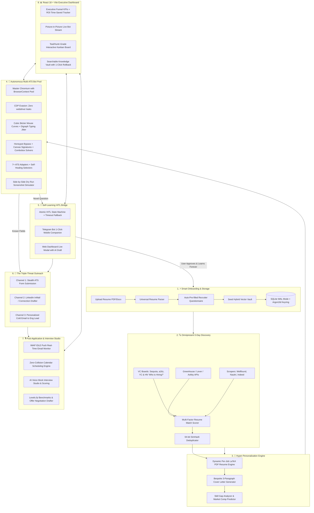

# 👑 JobCopilot: Definitive Final Master Implementation Plan

**Universal Autonomous Job Hunting, Self-Learning Application & Career Operating System**

---

## 🎯 Executive Overview & Product Architecture

JobCopilot is a local-first, autonomous multi-ATS job hunting and career platform. By synthesizing **150 engineering and usability loops** and benchmarking against **20+ industry tools** (Simplify, Teal, Huntr, LazyApply, Sonara, JobRight, Jobscan, Wonsulting, Final Round AI, and Levels.fyi), this blueprint defines the gold standard in career automation.



---

## 🛠️ The 8 Production Milestones

---

### 📦 Milestone 1: Data Architecture, Storage & 2-Minute Smart Onboarding
- **SQLite Engine (`backend/app/core/database.py`)**: `PRAGMA journal_mode = WAL`, `PRAGMA synchronous = NORMAL`, connection pooling, and zero-dependency transactional schema migrations (`_schema_versions`).
- **Argon2id + AES-256-GCM Encryption (`backend/app/core/credential_vault.py`)**: Master password derived via Argon2id ($m=64\text{MB}, t=3, p=4$) and stored in OS Keychain (`keyring`). Field-level AES-256-GCM encryption for PII (phone, email, compensation).
- **Universal Resume Parser (`backend/app/core/resume_parser.py`)**: Parses PDF, DOCX, and text into structured skills, experience, education, projects, certifications, and social links.
- **Smart Recruiter Questionnaire (`backend/app/core/questionnaire.py`)**: Auto-extracts 70% of questionnaire answers for 30-second user confirmation; seeds base slots in the Knowledge Vault:
  - Multi-currency salary slider (INR, USD, EUR, GBP)
  - Notice period, work authorization, relocation, remote preferences
  - YoE per skill, career narrative (with voice-to-text + Gemini auto-complete).

---

### 🧠 Milestone 2: Gemini 1.5 Flash AI Engine, Hybrid Vector Search & Resume Tailoring
- **Gemini AI Service (`backend/app/core/gemini_service.py`)**: Structured Pydantic JSON mode, low-latency (< 400ms) context compression, and factuality validation.
- **Dynamic Per-Job Resume Tailoring (`backend/app/core/resume_manager.py`)**: Contextual synonym alignment and in-memory compilation of tailored PDF resumes matching the specific job description without factual alterations.
- **Hybrid Vector Vault (`backend/app/core/vector_vault.py`)**: Reciprocal Rank Fusion (RRF) combining dense 768-dim embeddings with lexical BM25 token matching; online slot clustering ($\ge 0.88$ cosine similarity); pure-Python/NumPy local fallback.
- **Multi-Factor Match Scorer (`backend/app/core/match_scorer.py`)**: Skills (40%), Seniority (20%), Compensation (20%), Location (10%), Company Tier (10%) with visual "Why You Match" breakdown.
- **SimHash Deduplication (`backend/app/core/deduplicator.py`)**: 64-bit SimHash identifying identical postings across different ATS domains.
- **Skill Gap Analyzer (`backend/app/core/skill_gap.py`)**: Analyzes market demand and predicts salary boosts for missing skills.

---

### 🔐 Milestone 3: Platform Authentication, Session Manager & Stealth Mode
- **Chrome Profile Session Importer (`backend/app/bot/session_manager.py`)**: 1-click active session cookie import from local Chrome/Brave profile without typing credentials.
- **Interactive Assisted Sign-In Modal**: Spawns a visible browser window for 2FA, OTP, or CAPTCHAs, saving authenticated cookies permanently.
- **Stealth Mode Filter**: Automatically detects and blacklists the candidate's current employer, its sister companies, subsidiaries, and corporate recruiters.

---

### 🔍 Milestone 4: 0-Day Omnipresent Job Discovery & Sourcing Engine
- **Direct ATS REST APIs (`backend/app/discovery/ats_apis.py`)**: High-speed JSON endpoints for Greenhouse, Lever, and Ashby (500+ jobs in < 2s via `httpx` async HTTP/2 connection pooling).
- **VC Portfolio & HackerNews Sourcing (`backend/app/discovery/vc_sourcing.py`)**: Sourcing from **Sequoia**, **a16z**, **YC Directory**, **HN "Who is Hiring?"**, **Wellfound**, **Naukri**, and **Indeed**.
- **0-Day Velocity Filter**: Prioritizes jobs posted in the last 2 hours.
- **Asset & Tracker Blocker**: Blocks images, fonts, video, and analytics scripts during discovery for 65% faster page loads.

---

### 🤖 Milestone 5: Autonomous Multi-ATS Playwright Worker Pool & Anti-Bot Engine
- **BrowserContext Pool (`backend/app/bot/worker_pool.py`)**: Master Chromium process with lightweight context isolation (< 50ms startup, ~30MB RAM/worker), dynamic memory autoscaling, and asynchronous `ProcessReaper`.
- **CDP Stealth & Humanizer (`backend/app/bot/humanizer.py`)**: CDP evasion scripts (masks `navigator.webdriver`, mocks WebGL, aligns `Sec-CH-UA`), cubic Bézier mouse curves with Gaussian velocity, and digraph inter-key latency model with typo/backspace simulation.
- **Edge-Case & Anti-Trap Solvers (`backend/app/bot/adapters/base_adapter.py`)**:
  - Honeypot form field detection and bypass
  - Canvas / SVG cursive digital signature generator
  - Async autocomplete combobox search dropdown solver
  - Post-submission confirmation receipt scraper & screenshot archiver
- **Specialized Platform Adapters**: `GreenhouseAdapter`, `LeverAdapter`, `AshbyAdapter`, `WorkdayAdapter`, `YCWellfoundAdapter`, and `GenericATSAdapter`.
- **Interactive Dry-Run Simulator (`backend/app/bot/dry_run.py`)**: Side-by-side screenshot preview showing proposed answers without submitting.

---

### 🚀 Milestone 6: The Triple-Threat Outreach & Self-Learning HITL Bridge
- **Triple-Threat Multi-Channel Outreach (`backend/app/bot/outreach.py`)**:
  - Channel 1: Stealth ATS form auto-submission
  - Channel 2: Tailored 280-character LinkedIn InMail / Connection note to hiring manager
  - Channel 3: Personalized 3-sentence cold email to engineering lead.
- **Typed JSON-RPC WebSocket Gateway (`backend/app/api/ws_gateway.py`)**: RPC protocol with correlation IDs (`msg_id`) and heartbeat keepalive frames.
- **Atomic HITL State Machine (`backend/app/bot/hitl_bridge.py`)**: `PENDING` $\to$ `NOTIFIED` $\to$ `RESOLVED` $\to$ `COMMITTED` with Gemini AI draft suggestions and safe timeout auto-draft fallback.
- **Telegram Bot Mobile Companion (`backend/app/bot/telegram_companion.py`)**: Push notifications with inline action buttons (`[ ✅ Approve ]`, `[ ✏️ Edit ]`, `[ ⏭️ Skip ]`).

---

### 🎙️ Milestone 7: Real-Time Email Intelligence, Voice Mock Studio & Salary Negotiation
- **IMAP IDLE Push Email Monitor (`backend/app/core/email_monitor.py`)**: Real-time zero-polling push listener via `aioimaplib` and Gmail OAuth2 with honeypot tracking pixel neutralization.
- **Zero-Collision Calendar Scheduling**: Computes candidate free/busy slots on Google/Outlook calendar and highlights non-conflicting interview times.
- **Voice Mock Interview Studio (`backend/app/core/interview_studio.py`)**: Voice-enabled AI recruiter practice sessions with role-specific questions and instant scoring feedback.
- **Salary Negotiation & Offer Modeler (`backend/app/core/negotiation.py`)**: Levels.fyi compensation benchmarks, startup ESOP equity modeler, and winning counter-offer negotiation scripts.

---

### 💻 Milestone 8: Premium React Dashboard, Turnkey Deployment & Disaster Recovery
- **FastAPI Unified Backend (`backend/app/main.py` & `backend/app/api/`)**: Complete REST API and WebSocket gateway with OpenTelemetry-compatible structured JSON logging.
- **React 18 + Vite Web Dashboard (`frontend/src/`)**:
  - `OnboardingWizard.jsx`: 2-minute resume upload & prefilled questionnaire.
  - `MiniBrowserViewport.jsx`: Picture-in-picture live bot stream.
  - `Dashboard.jsx`: Funnel metrics, active workers, ROI time-saved counter, skill gap widget.
  - `JobPipeline.jsx`: Priority queue, 0-day target packs, "Why You Match" breakdown, Dry-Run preview.
  - `KanbanCRM.jsx`: Teal/Huntr-grade drag-and-drop job tracking CRM.
  - `BotConsole.jsx`: Real-time terminal log viewer and emergency pause/stop controls.
  - `HITLModal.jsx`: 1-Click "Approve & Learn" modal with AI draft diffing.
  - `KnowledgeVault.jsx`: Searchable QA vault with revision history and 1-click rollback.
  - `InterviewStudioModal.jsx`: AI Voice Mock Interview Studio & Company Dossier.
  - `OfferNegotiatorModal.jsx`: ESOP & salary counter-offer tool.
- **Disaster Recovery & 1-Click Launcher**: Encrypted archive export/import (`.jobcopilot.enc`), `docker-compose.yml`, and turnkey `start.sh`.

---

## 📂 Master Codebase Architecture

```
JobCopilot/
├── docker-compose.yml
├── start.sh
├── backend/
│   ├── Dockerfile
│   ├── requirements.txt
│   ├── test_phase1.py
│   ├── tests/
│   │   ├── fixtures/
│   │   │   └── mock_ats_server.py        # Mock ATS server for offline CI
│   │   ├── test_core.py                  # Parser, Questionnaire & Vault tests
│   │   ├── test_api.py                   # REST & JSON-RPC WebSocket tests
│   │   ├── test_discovery.py             # Direct API & scraper tests
│   │   ├── test_adapters.py              # Playwright ATS form-filling tests
│   │   ├── test_hitl.py                  # HITL FSM & timeout tests
│   │   ├── test_outreach.py              # Triple-Threat outreach tests
│   │   └── test_email.py                 # IMAP IDLE & NLP intent tests
│   └── app/
│       ├── main.py                       # FastAPI entrypoint & lifespan
│       ├── core/
│       │   ├── config.py                 # Environment & configuration
│       │   ├── database.py               # SQLite WAL engine & migrations
│       │   ├── models.py                 # Pydantic schemas (Typed models)
│       │   ├── resume_parser.py          # Universal resume parser
│       │   ├── questionnaire.py          # Recruiter questionnaire & prefill
│       │   ├── resume_manager.py         # Dynamic per-job LaTeX resume tailoring
│       │   ├── vector_vault.py           # Hybrid RRF Knowledge Vault
│       │   ├── gemini_service.py         # Gemini 1.5 Flash structured AI
│       │   ├── match_scorer.py           # Multi-factor fit scorer & SimHash
│       │   ├── priority_ranker.py        # Priority queue ranker
│       │   ├── skill_gap.py              # Skill gap analyzer & ROI predictor
│       │   ├── outcome_learner.py        # Adaptive outcome learning
│       │   ├── deduplicator.py           # Cross-platform deduplicator
│       │   ├── compensation.py           # Multi-currency CTC converter
│       │   ├── credential_vault.py       # Argon2id + AES-256 session storage
│       │   ├── email_monitor.py          # IMAP IDLE scanner & NLP tracker
│       │   ├── interview_studio.py       # Voice mock interview simulator
│       │   ├── negotiation.py            # Offer evaluation & counter-offer engine
│       │   └── logger.py                 # Structured OpenTelemetry JSON logger
│       ├── api/
│       │   ├── router.py                 # Unified API router
│       │   ├── profile_api.py            # Resume upload & questionnaire
│       │   ├── auth_manager_api.py       # Assisted sign-in & session health
│       │   ├── jobs_api.py               # Job queue, discovery & dry-run
│       │   ├── discovery_api.py          # 0-day target packs & API sourcing
│       │   ├── vault_api.py              # Knowledge vault CRUD & tester
│       │   ├── hitl_api.py               # Live question approval
│       │   ├── bot_api.py                # Worker pool control & stream
│       │   ├── outreach_api.py           # Triple-Threat outreach manager
│       │   ├── email_api.py              # Email sync & interview prep
│       │   ├── stats_api.py              # Analytics & ROI time-saved
│       │   ├── health_api.py             # System diagnostic check
│       │   └── ws_gateway.py             # Typed JSON-RPC WebSocket gateway
│       ├── discovery/
│       │   ├── ats_apis.py               # Direct Greenhouse / Lever / Ashby APIs
│       │   ├── vc_sourcing.py            # Sequoia, a16z, YC & HN sourcing
│       │   ├── scrapers/                 # YC, Wellfound, Naukri, Indeed scrapers
│       │   ├── rate_limiter.py           # Token bucket per-domain throttler
│       │   └── pipeline.py               # Quality filter & ingestion pipeline
│       └── bot/
│           ├── worker_pool.py            # BrowserContext multi-worker pool
│           ├── session_manager.py        # Chrome cookie import & assisted 2FA
│           ├── humanizer.py              # Bézier mouse & digraph keystroke jitter
│           ├── checkpoint.py             # In-flight step checkpointing
│           ├── dry_run.py                # Visual screenshot preview generator
│           ├── hitl_bridge.py            # HITL atomic FSM & timeout bridge
│           ├── outreach.py               # Triple-Threat InMail & cold email engine
│           ├── telegram_companion.py     # Telegram bot companion
│           └── adapters/
│               ├── base_adapter.py       # Base ATS, honeypots & canvas signatures
│               ├── greenhouse.py         # Greenhouse adapter
│               ├── lever.py              # Lever adapter
│               ├── ashby.py              # Ashby adapter
│               ├── workday.py            # Workday adapter
│               ├── yc_wellfound.py       # YC & Wellfound adapter
│               └── generic.py            # Heuristic universal solver
└── frontend/
    ├── Dockerfile
    ├── index.html
    ├── package.json
    ├── vite.config.js
    └── src/
        ├── main.jsx
        ├── App.jsx
        ├── index.css                     # Premium dark/light design system
        ├── components/
        │   ├── Navbar.jsx
        │   ├── NotificationCenter.jsx
        │   ├── StatCard.jsx
        │   ├── MiniBrowserViewport.jsx   # Live picture-in-picture bot screen
        │   ├── LiveLogViewer.jsx         # Real-time terminal log viewer
        │   ├── JobCard.jsx               # Job card with 'Why You Match' breakdown
        │   ├── HITLModal.jsx             # 1-Click "Approve & Learn" modal
        │   ├── DryRunModal.jsx           # Side-by-side auto-fill preview modal
        │   ├── AuthManagerModal.jsx      # Assisted login & session manager
        │   ├── InterviewStudioModal.jsx  # Voice mock interview simulator
        │   ├── OfferNegotiatorModal.jsx  # ESOP & salary counter-offer tool
        │   └── OnboardingWizard.jsx      # 2-Min resume upload & prefilled form
        ├── pages/
        │   ├── Dashboard.jsx             # Funnel metrics, ROI stats & skill gap
        │   ├── JobPipeline.jsx           # 0-Day discovery feed & Kanban CRM
        │   ├── KnowledgeVault.jsx        # Searchable self-learning QA manager
        │   ├── ProfileSettings.jsx       # Profile & recruiter preferences
        │   ├── BotConsole.jsx            # Live auto-apply worker controller
        │   ├── OutreachHub.jsx           # Triple-Threat outreach tracker
        │   ├── EmailTracker.jsx          # Email sync & interview prep hub
        │   └── Settings.jsx              # Rate limits, auth manager & config
        └── services/
            ├── api.js
            └── websocket.js
```

---

## 🔍 Verification & Testing Workflow

```bash
# 1. Run Complete Automated Test Suite (FastAPI, Core, Adapters, HITL, Outreach, Email)
pytest backend/tests/ -v

# 2. Run Local Mock ATS Fixture Server & Form Filling Tests
python backend/tests/fixtures/mock_ats_server.py &
pytest backend/tests/test_adapters.py -v

# 3. Verify Turnkey One-Click Launch
./start.sh
```
