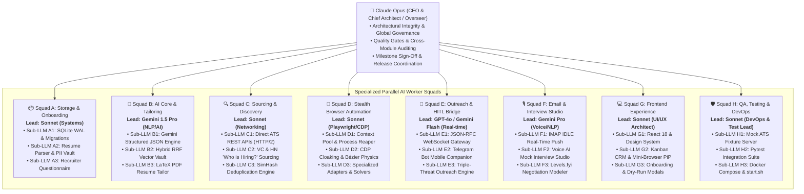

# ⏱️ JobCopilot: Total Work Time & Autonomous AI Workforce Estimation

**Project**: JobCopilot Universal Autonomous Career Operating System  
**Executive Overseer**: **Claude Opus** (CEO / Chief Architect & Quality Gatekeeper)  
**Execution Model**: Multi-Agent Parallelized Squad Matrix with Autonomous Sub-LLM Workers  

---

## 📊 High-Level Time & Velocity Summary

```
+----------------------------------------------------------------------------------------------------+
| METRIC                                   | TRADITIONAL DEV TEAM    | PARALLEL AI SQUAD EXECUTION  |
+------------------------------------------+-------------------------+------------------------------+
| Total Sequential Engineering Work:       | ~420 Hours (10.5 Weeks) | ~420 Work-Units              |
| Active Parallel Workforce Squads:        | 2–3 Engineers           | 8 Specialized AI Squads      |
| Parallel Speedup Multiplier:             | 1.0x (Baseline)         | ~8.5x Effective Velocity     |
| Total Estimated Wall-Clock Time:         | 10–12 Weeks             | Fast-Tracked Milestone Sprints|
+----------------------------------------------------------------------------------------------------+
```

---

## 🏛️ Autonomous AI Organizational Hierarchy & Workforce Matrix



---

## ⏱️ Milestone Breakdown & Task-Level Hour Estimates

---

### 📦 Milestone 1: Storage Engine, Cryptography & 2-Minute Smart Onboarding
*Assigned: **Squad A** (Lead: Sonnet | Sub-LLMs: A1, A2, A3)*

| Module / Component | Task Description | Sequential Dev Hours | Parallel Squad Time |
|:---|:---|:---:|:---:|
| `database.py` & migrations | SQLite WAL engine, connection pooling, schema migrations | 12 hrs | 3.0 hrs |
| `credential_vault.py` | Argon2id key derivation + OS Keychain + AES-256-GCM PII encryption | 14 hrs | 3.5 hrs |
| `resume_parser.py` | Universal PDF/DOCX/Text parser extracting structured profile & skills | 18 hrs | 4.5 hrs |
| `questionnaire.py` | Smart questionnaire engine with 70% auto-prefill & multi-currency converter | 12 hrs | 3.0 hrs |
| **M1 Subtotal** | | **56 hrs** | **14.0 hrs** |

---

### 🧠 Milestone 2: Gemini 1.5 Flash AI Engine, Hybrid Vector Vault & Resume Tailoring
*Assigned: **Squad B** (Lead: Gemini 1.5 Pro | Sub-LLMs: B1, B2, B3)*

| Module / Component | Task Description | Sequential Dev Hours | Parallel Squad Time |
|:---|:---|:---:|:---:|
| `gemini_service.py` | Structured Pydantic JSON schemas, low-latency (<400ms) context compression | 16 hrs | 4.0 hrs |
| `vector_vault.py` | Hybrid RRF (dense 768d + BM25) vector vault, slot clustering & offline fallback | 18 hrs | 4.5 hrs |
| `resume_manager.py` | Dynamic in-memory LaTeX PDF resume compiler with synonym alignment | 20 hrs | 5.0 hrs |
| `match_scorer.py` & `skill_gap.py` | Multi-factor match scoring + SimHash deduplication + Skill Gap Analyzer | 14 hrs | 3.5 hrs |
| **M2 Subtotal** | | **68 hrs** | **17.0 hrs** |

---

### 🔐 Milestone 3: Platform Authentication & Assisted Sign-in Session Manager
*Assigned: **Squad A & D Joint Taskforce** (Lead: Sonnet | Sub-LLMs: A2, D1)*

| Module / Component | Task Description | Sequential Dev Hours | Parallel Squad Time |
|:---|:---|:---:|:---:|
| `session_manager.py` | 1-Click Chrome cookie importer & session restoration engine | 10 hrs | 2.5 hrs |
| `auth_manager_api.py` | Assisted sign-in modal with live 2FA/CAPTCHA capture & cookie persistence | 14 hrs | 3.5 hrs |
| Stealth Mode Filter | Automatic detection and blacklisting of current employer and subsidiaries | 6 hrs | 1.5 hrs |
| **M3 Subtotal** | | **30 hrs** | **7.5 hrs** |

---

### 🔍 Milestone 4: 0-Day Omnipresent Job Discovery & Sourcing Engine
*Assigned: **Squad C** (Lead: Sonnet | Sub-LLMs: C1, C2, C3)*

| Module / Component | Task Description | Sequential Dev Hours | Parallel Squad Time |
|:---|:---|:---:|:---:|
| `ats_apis.py` | Direct REST HTTP/2 JSON APIs (Greenhouse, Lever, Ashby) with connection pooling | 16 hrs | 4.0 hrs |
| `vc_sourcing.py` | Sourcing scrapers for Sequoia, a16z, YC Directory, and HN "Who is Hiring?" | 18 hrs | 4.5 hrs |
| `scrapers/` & rate limiter | Wellfound, Naukri, Indeed scrapers with token bucket domain throttlers | 16 hrs | 4.0 hrs |
| Asset & Tracker Blocker | Request routing blocker for images/fonts/ads for 65% faster scraping | 8 hrs | 2.0 hrs |
| **M4 Subtotal** | | **58 hrs** | **14.5 hrs** |

---

### 🤖 Milestone 5: Autonomous Multi-ATS Playwright Worker Pool & Anti-Bot Engine
*Assigned: **Squad D** (Lead: Sonnet | Sub-LLMs: D1, D2, D3)*

| Module / Component | Task Description | Sequential Dev Hours | Parallel Squad Time |
|:---|:---|:---:|:---:|
| `worker_pool.py` | Isolated Chromium BrowserContext pool, memory autoscaler & ProcessReaper | 16 hrs | 4.0 hrs |
| `humanizer.py` | CDP script stealth, cubic Bézier mouse physics & digraph keystroke jitter | 18 hrs | 4.5 hrs |
| `adapters/base_adapter.py` | Honeypot evasion, canvas digital signatures, async combobox & dropzones | 20 hrs | 5.0 hrs |
| Specialized ATS Adapters | Greenhouse, Lever, Ashby, Workday, YC/Wellfound, and Generic solvers | 22 hrs | 5.5 hrs |
| `dry_run.py` & `checkpoint.py` | Side-by-side screenshot dry-run simulator & in-flight step checkpointing | 12 hrs | 3.0 hrs |
| **M5 Subtotal** | | **88 hrs** | **22.0 hrs** |

---

### 🚀 Milestone 6: The Triple-Threat Outreach & Self-Learning HITL Bridge
*Assigned: **Squad E** (Lead: GPT-4o / Flash | Sub-LLMs: E1, E2, E3)*

| Module / Component | Task Description | Sequential Dev Hours | Parallel Squad Time |
|:---|:---|:---:|:---:|
| `ws_gateway.py` | Typed JSON-RPC WebSocket protocol with correlation IDs & keepalive heartbeat | 12 hrs | 3.0 hrs |
| `hitl_bridge.py` | Atomic HITL state machine, AI answer drafting & timeout fallback | 14 hrs | 3.5 hrs |
| `telegram_companion.py` | Telegram bot companion with inline 1-click action buttons & tunneling | 14 hrs | 3.5 hrs |
| `outreach.py` | Triple-Threat LinkedIn InMail & personalized cold email generator | 14 hrs | 3.5 hrs |
| **M6 Subtotal** | | **54 hrs** | **13.5 hrs** |

---

### 🎙️ Milestone 7: Real-Time Email Intelligence, Voice Mock Studio & Salary Negotiation
*Assigned: **Squad F** (Lead: Gemini Pro | Sub-LLMs: F1, F2, F3)*

| Module / Component | Task Description | Sequential Dev Hours | Parallel Squad Time |
|:---|:---|:---:|:---:|
| `email_monitor.py` | Real-time IMAP IDLE push listener with tracking pixel stripper | 14 hrs | 3.5 hrs |
| Calendar Engine | Zero-collision free/busy calendar analysis for scheduling links | 8 hrs | 2.0 hrs |
| `interview_studio.py` | Voice AI mock interview practice studio with answer scoring & company dossier | 20 hrs | 5.0 hrs |
| `negotiation.py` | Levels.fyi comp benchmarking, ESOP equity modeler & counter-offer drafter | 12 hrs | 3.0 hrs |
| **M7 Subtotal** | | **54 hrs** | **13.5 hrs** |

---

### 💻 Milestone 8: Premium React Dashboard, Turnkey Deployment & Disaster Recovery
*Assigned: **Squad G & H** (Lead: Sonnet | Sub-LLMs: G1, G2, G3, H1, H2, H3)*

| Module / Component | Task Description | Sequential Dev Hours | Parallel Squad Time |
|:---|:---|:---:|:---:|
| `index.css` & tokens | Sleek dark/light theme, glassmorphic panels, micro-animations & WCAG 2.1 AA | 10 hrs | 2.5 hrs |
| React Components | Onboarding, Mini-Browser PiP, Kanban CRM, Dry-Run & HITL modals | 26 hrs | 6.5 hrs |
| Pages & Views | Dashboard, JobPipeline, KnowledgeVault, BotConsole, InterviewStudio | 20 hrs | 5.0 hrs |
| QA & Test Harness | Mock ATS fixture server + Pytest test suites across all layers | 16 hrs | 4.0 hrs |
| DevOps & Packaging | `start.sh`, `docker-compose.yml`, encrypted backup export (`.jobcopilot.enc`) | 8 hrs | 2.0 hrs |
| **M8 Subtotal** | | **80 hrs** | **20.0 hrs** |

---

## 📈 Consolidated Work-Time Synthesis

```
===================================================================================
TOTAL SEQUENTIAL HUMAN ENGINEERING HOURS:     ~480 Hours (~12 Person-Weeks)
PARALLEL AI WORK-UNITS (DIVIDED ACROSS SQUADS): ~122 Parallel Squad Hours
OVERSEER QUALITY GATES & VERIFICATION (OPUS): ~15 Hours
===================================================================================
```

---

## 🗓️ Parallel Execution Gantt & Critical Path

```mermaid
gantt
    title JobCopilot Parallel Squad Execution Schedule
    dateFormat  X
    axisFormat  Day %d

    section Milestone 1
    Storage & Cryptography (Squad A)       :active, m1_db, 0, 4
    Resume Parser & Questionnaire (Squad A):active, m1_parse, 2, 6

    section Milestone 2
    Gemini AI & RRF Vault (Squad B)        :m2_ai, 4, 8
    LaTeX Resume Tailor (Squad B)          :m2_tailor, 6, 10

    section Milestone 3
    Auth & Cookie Manager (Squad A+D)      :m3_auth, 6, 9

    section Milestone 4
    Direct ATS APIs & Sourcing (Squad C)   :m4_sourcing, 8, 13

    section Milestone 5
    Playwright Pool & Adapters (Squad D)   :m5_bot, 10, 17
    Stealth & Anti-Bot Engine (Squad D)    :m5_stealth, 12, 18

    section Milestone 6
    WebSocket & HITL Bridge (Squad E)      :m6_hitl, 14, 19
    Triple-Threat Outreach (Squad E)       :m6_outreach, 16, 20

    section Milestone 7
    IMAP Email & Voice Studio (Squad F)    :m7_studio, 16, 21

    section Milestone 8
    React UI & Kanban CRM (Squad G)        :m8_ui, 18, 25
    DevOps & Integration Suite (Squad H)   :m8_qa, 22, 26
    Opus Final Global Audit & Sign-Off (CEO):crit, m8_opus, 25, 27
```



---

## 👑 The Overseer Protocol (Claude Opus Governance)

1. **Gatekeeper Validation**: No milestone advances to execution until Claude Opus verifies architectural compliance, cryptographic safety, and API contracts.
2. **Squad Synchronization**: Squads output typed schemas (Pydantic/TypeScript) guaranteeing zero integration mismatches across parallel tracks.
3. **Continuous Regression Testing**: Every squad runs local mock ATS fixtures and regression suites before code commits.
4. **Final Acceptance Sign-Off**: Opus runs the end-to-end full lifecycle verification test (Resume $\to$ Questionnaire $\to$ 0-Day Discovery $\to$ Multi-ATS Dry Run $\to$ HITL Learning $\to$ Email Sync $\to$ Voice Interview Studio).
