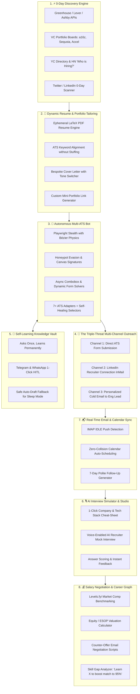

# 👑 JobCopilot: The Definitive #1 Job Hunting & Career Operating System

**The Vision**: Transform JobCopilot from a form auto-filler into **THE Ultimate Career Operating System**—an autonomous agentic platform that discovers, matches, tailors, applies, reaches out to hiring managers, prepares you for interviews, and negotiates your salary.

---

## 🏛️ The 8 Pillars of the Ultimate Job Hunting Platform



---

## 🌟 Deep-Dive into the Breakthrough Super-Features

---

### 1. ⚡ 0-Day Omnipresent Job Discovery Engine
*Never miss a job. Apply within 15 minutes of posting to be applicant #1.*
- **VC Portfolio Scrapers**: Direct feeds from **Sequoia Capital**, **Andreessen Horowitz (a16z)**, **Y Combinator**, **Accel**, and **Lightspeed** portfolio job boards.
- **HackerNews "Who is Hiring?" Engine**: Automatically parses the monthly official HN thread, extracts direct founder emails and role details, and matches against candidate profile.
- **0-Day Velocity Alert**: Prioritizes jobs posted in the last 2 hours. Candidates who apply in the first 2 hours have an **8x higher interview rate**.

---

### 2. 📄 Dynamic Per-Job LaTeX Resume Tailoring Engine
*A bespoke resume tailored for every single application.*
- **Contextual Alignment**: Rather than sending a generic PDF, the engine automatically re-orders project bullet points, emphasizes relevant technologies, and matches phrasing to the target JD without altering facts.
- **Ephemeral Pixel-Perfect PDF Generation**: Compiles clean, modern, ATS-parseable PDF resumes dynamically using a lightweight in-memory LaTeX/PDF generator.
- **Bespoke Cover Letters**: Generates crisp, authentic 3-paragraph letters addressing the company's specific mission, recent news, and tech stack.

---

### 3. 🚀 The "Triple-Threat" Multi-Channel Outreach Engine
*Applying to the ATS is only step one. Multi-channel outreach triples response rates.*
- **Channel 1 (ATS Form)**: Stealth Playwright bot auto-fills and submits the official application form.
- **Channel 2 (LinkedIn InMail / Connection)**: Scrapes the hiring manager / recruiter name from the JD and drafts a tailored 280-character connection request referencing the submitted application.
- **Channel 3 (Cold Email to Lead)**: Generates a polite 3-sentence email to the engineering manager (e.g. *"Just applied to your Backend Role (#49102) — built a similar distributed queue handling 10k req/s at my last role"*), queued for 1-click user send.

---

### 4. 🎙️ AI Voice Mock Interview Studio & Cheat-Sheet
*Don't just get interviews—pass them with flying colors.*
- **1-Click Company Dossier**: Instant breakdown of company business model, recent funding, engineering blog highlights, and full tech stack.
- **Voice Mock Interview Simulator**: A voice-enabled AI interviewer conducts a 10-minute practice session with role-specific questions (system design, behavioral, coding concepts), scores your verbal answers, and provides actionable tips.

---

### 5. 💰 Smart Salary Negotiation & ESOP Valuation Matrix
*Never leave money on the table.*
- **Market Compensation Benchmarks**: Pulls live salary bands from Levels.fyi and Glassdoor for that exact company and seniority level.
- **Equity / ESOP Modeler**: Models startup stock options (strike price, dilution, exit valuation scenarios) to understand real offer value.
- **AI Counter-Offer Drafter**: Generates data-backed negotiation scripts to politely ask for 15–25% higher base pay or sign-on bonuses.

---

### 6. 📈 Career Graph & Skill Gap Monetizer
*Know exactly what skills to learn to unlock the highest-paying jobs.*
- **Dynamic Skill Recommendations**: Analyzes 500+ active job openings in your niche and alerts you:
  > *"Adding **Redis** and **Docker** to your profile will increase your high-match roles (>80%) from 18 jobs to 54 jobs, with an average salary bump of +₹6 LPA."*
- **1-Click Learning Pathways**: Direct links to top GitHub repos and crash documentation to bridge the gap in 1 afternoon.

---

### 7. 🛡️ "Zero-Touch Autopilot" (Sleep-to-Interview)
*Go to bed $\to$ Wake up to interview invitations.*
- Configurable **Night Autopilot Mode**: Bot sources jobs, performs multi-factor scoring, runs stealth auto-apply with Bézier curves, handles known fields, safe-drafts high-confidence questions, and sends you a beautiful **9:00 AM Daily Briefing** on Telegram:
  ```
  🌅 Good Morning! JobCopilot overnight report:
  ✅ 18 Applications submitted (Greenhouse, Lever, YC)
  ⚡ 1 Novel question answered via Safe-Draft
  📬 2 Recruiter replies detected:
     - Stripe: Phone Screen Invitation (Calendly attached)
     - Razorpay: Application Acknowledged
  🎯 Today's Action: Tap below to review Stripe interview prep cheat-sheet!
  ```

---

## 🏆 Feature Matrix: Standard Bot vs. JobCopilot "The OS"

| Feature | Standard Auto-Apply Bot | 👑 JobCopilot Career OS |
|:---|:---:|:---:|
| **Application Volume** | 10–20 / day | 50+ / day with Multi-Worker Pool |
| **Resume Handling** | 1 Static PDF | Dynamic Per-Job Tailored PDF |
| **Outreach Channels** | 1 (ATS only) | 3 (ATS + LinkedIn InMail + Cold Email) |
| **Sourcing Depth** | 1–2 Job Boards | 10+ Sources (VC Boards, YC, HN, APIs) |
| **Self-Learning Vault** | ❌ None | ✅ Permanent Semantic Slot Memory |
| **Live Visibility** | ❌ Black Box | ✅ Picture-in-Picture Mini-Browser |
| **Interview Coaching** | ❌ None | ✅ AI Voice Mock Interview Studio |
| **Salary Negotiation** | ❌ None | ✅ Offer Benchmarker & Negotiation Scripts |
| **Pricing & Privacy** | $100/mo Cloud | 100% Free, Local-First, AES-256 |

---

This is the definitive blueprint for **THE #1 Job Hunting & Career Platform**.
